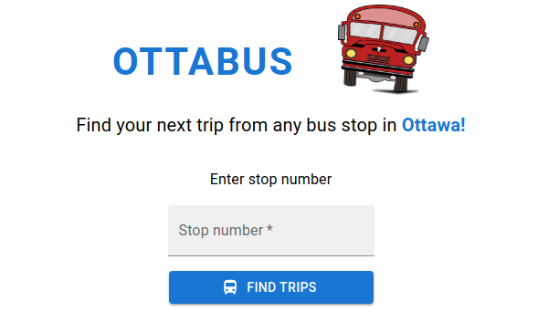

<h1 align="center">
 <br>
  <a href=""></a>
  <br>
  OTTABUS
</h1>
<h3 align="center">All bus stops of Ottawa in one app!</h3>
<p align="center">
  
  
  
  
</p>
<p align="center">
</p>
<h3 align="center"><a  href="">See live</a></h3>

## Description

With constantly increasing gas prices more and more people rely on local public transportation daily. I live in Ottawa and use OC transpo services often. This app helps fellow commuters learn what buses are coming to a particular stop and in how many minutes they will arrive. The app also shows the current location of a selected bus on an integrated Google map, as well as the current weather in Ottawa. To build this app I used OC Transpo API, Google Maps API and Open Weather API. This app is my first attempt using TypeScript and MaterialUI. I keep learning React Testing Library and used it to write tests for Ottabus.

## Key Features

- Enter stop number
- See upcoming trips
- See in how many minutes the buses are arriving
- See the location of a selected bus on a map
- See the current weather in Ottawa

## Project Screenshots

<p align="center">
  </p>
 <p align="center">
  
  
  </p>
 <p align="center">
  </p>

## Getting Started

Clone the repository:

```
git clone git@github.com:RReiso/Ottabus.git
cd Ottabus
```

Install dependencies:

```
npm install
```

Run the app:

```
npm start
```

Open http://localhost:3000 to view it in your browser.

## Dependencies

- @mui/icons-material: ^5.6.1
- @mui/material: ^5.6.1
- @react-google-maps/api: ^2.8.1
- @testing-library/jest-dom: ^5.16.2
- @testing-library/react: ^12.1.2
- @testing-library/user-event: ^13.5.0
- @types/jest: ^27.4.1
- @types/node: ^16.11.27
- @types/react: ^18.0.5
- @types/react-dom: ^18.0.1
- axios: ^0.26.1
- axios-mock-adapter: ^1.20.0
- react: ^17.0.2
- react-dom: ^17.0.2
- react-scroll-into-view: ^1.12.0
- typescript: ^4.6.3
